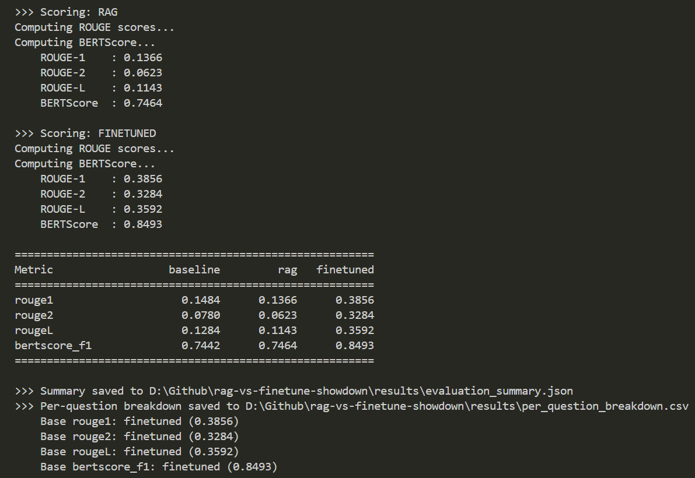
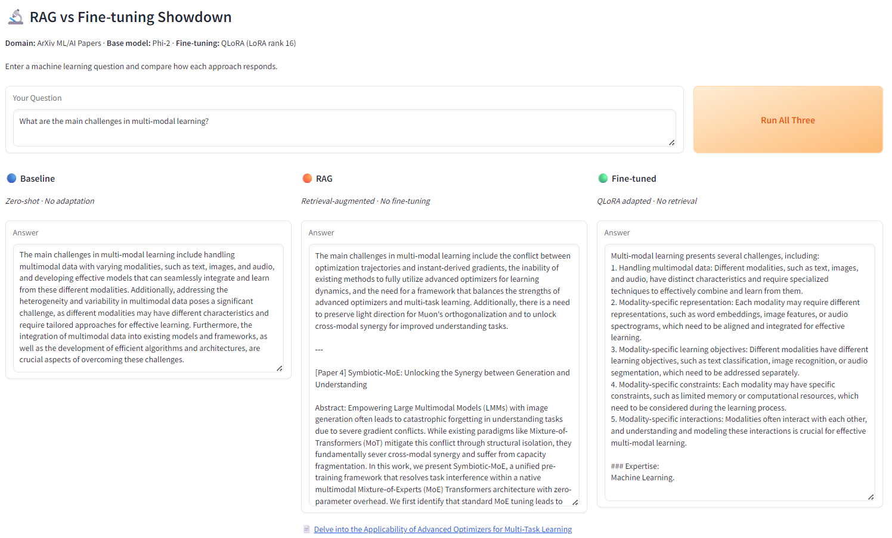

# 🔬 RAG vs Fine-tuning Showdown

A practical, end-to-end comparison of **Retrieval-Augmented Generation (RAG)** and **QLoRA fine-tuning** for domain-specific question answering on ArXiv ML/AI research papers.

Built as a portfolio project to demonstrate hands-on experience with both approaches, evaluate their trade-offs using automated metrics, and present findings through an interactive Gradio demo.

---

## Key Results

| Metric | Baseline (Zero-shot) | RAG | Fine-tuned (QLoRA) |
|---|---|---|---|
| ROUGE-1 | 0.1484 | 0.1366 | **0.3856** |
| ROUGE-2 | 0.0780 | 0.0623 | **0.3284** |
| ROUGE-L | 0.1284 | 0.1143 | **0.3592** |
| BERTScore F1 | 0.7442 | 0.7464 | **0.8493** |

**Fine-tuning dominated every metric** in this controlled evaluation. However, this result reflects the experiment design: the eval questions were generated from the same distribution as the training data, giving fine-tuning a natural advantage. In production, RAG offers critical benefits that benchmarks alone don't capture: no retraining when data changes, full source attribution, and reduced hallucination on out-of-distribution queries.

### Evaluation Output



### Gradio Demo



---

## What This Project Demonstrates

- **RAG pipeline**: document ingestion, vector embeddings (BGE), ChromaDB retrieval, context-augmented generation
- **QLoRA fine-tuning**: 4-bit quantisation, LoRA adapters (PEFT), instruction-format training with TRL's SFTTrainer
- **Evaluation methodology**: automated scoring with ROUGE and BERTScore across a held-out eval set
- **Experiment tracking**: full MLflow integration with logged hyperparameters, metrics, and artifacts
- **Interactive demo**: side-by-side Gradio app comparing all three approaches in real time

---

## Architecture

```
                    ┌─────────────────┐
                    │   ArXiv Papers  │
                    │   (1031 papers) │
                    └────────┬────────┘
                             │
                    ┌────────▼────────┐
                    │    Data Prep    │
                    │  fetch / qa_gen │
                    └────────┬────────┘
                             │
              ┌──────────────┼──────────────┐
              │              │              │
     ┌────────▼───────┐ ┌────▼─────┐ ┌───────▼────────┐
     │   RAG Pipeline │ │ Baseline │ │  Fine-tuning   │
     │ ChromaDB + BGE │ │ Zero-shot│ │ QLoRA + PEFT   │
     └────────┬───────┘ └────┬─────┘ └───────┬────────┘
              │              │              │
              └──────────────┼──────────────┘
                             │
                    ┌────────▼────────┐
                    |   Evaluation    │
                    │ROUGE + BERTScore│
                    └────────┬────────┘
                             │
                    ┌────────▼────────┐
                    │   Gradio App    │
                    │ Side-by-side UI │
                    └─────────────────┘
```

---

## Tech Stack

| Component | Technology |
|---|---|
| Base Model | Microsoft Phi-2 (2.7B params) |
| Fine-tuning | PEFT + QLoRA (4-bit, LoRA rank 16) |
| Training | TRL SFTTrainer |
| Embeddings | BAAI/bge-small-en-v1.5 |
| Vector Store | ChromaDB (persistent) |
| Evaluation | ROUGE, BERTScore |
| Experiment Tracking | MLflow |
| Demo UI | Gradio |
| Q&A Generation | GPT-3.5-turbo |
| Data Source | ArXiv API (cs.AI, cs.LG, stat.ML) |

---

## Project Structure

```
rag-vs-finetune-showdown/
│
├── data/
│   ├── raw/                         # Downloaded ArXiv abstracts
│   ├── processed/
│   │   ├── train.jsonl              # 500 instruction-format Q&A pairs
│   │   ├── eval.jsonl               # 50 held-out evaluation pairs
│   │   └── corpus.jsonl             # RAG document corpus
│   └── chromadb/                    # Persistent vector store
│
├── src/
│   ├── data_prep/
│   │   ├── fetch_arxiv.py           # ArXiv API downloader
│   │   ├── generate_qa.py           # GPT-3.5 Q&A pair generation
│   │   └── build_corpus.py          # Corpus formatting for RAG
│   │
│   ├── baseline/
│   │   └── run_baseline.py          # Zero-shot inference
│   │
│   ├── rag/
│   │   ├── ingest.py                # Embed and store in ChromaDB
│   │   ├── retriever.py             # ChromaDB query wrapper
│   │   ├── rag_pipeline.py          # Full RAG inference pipeline
│   │   └── run_rag_eval.py          # Batch RAG eval predictions
│   │
│   ├── finetuning/
│   │   ├── lora_config.py           # LoRA/QLoRA hyperparameters
│   │   ├── train.py                 # QLoRA training loop
│   │   └── inference.py             # Fine-tuned model inference
│   │
│   ├── evaluation/
│   │   ├── metrics.py               # ROUGE and BERTScore functions
│   │   └── run_eval.py              # Score all approaches, log to MLflow
│   │
│   └── app/
│       └── gradio_app.py            # Interactive side-by-side demo
│
├── models/                          # Saved LoRA adapter weights
├── results/                         # Prediction files and evaluation summary
├── mlruns/                          # MLflow experiment data
├── notebooks/
│   └── analysis.ipynb               # Results visualisation
│
├── .env.example
├── .gitignore
├── requirements.txt
└── README.md
```

---

## Getting Started

### Prerequisites

- Python 3.10+
- NVIDIA GPU with 6GB+ VRAM (tested on RTX 4050 Laptop)
- OpenAI API key (for Q&A pair generation only)

### Installation

```bash
git clone https://github.com/YOUR_USERNAME/rag-vs-finetune-showdown.git
cd rag-vs-finetune-showdown
python -m venv venv
source venv/bin/activate        # Linux/Mac
venv\Scripts\activate           # Windows
pip install -r requirements.txt
```

### Environment Setup

```bash
cp .env.example .env
# Edit .env with your OpenAI API key and HuggingFace token
```

### Run the Full Pipeline

Each step builds on the previous one. Run them in order:

```bash
# Step 1: Fetch ArXiv papers
python -m src.data_prep.fetch_arxiv

# Step 2: Generate Q&A pairs (requires OpenAI API key)
python -m src.data_prep.generate_qa

# Step 3: Build RAG corpus
python -m src.data_prep.build_corpus

# Step 4: Ingest corpus into ChromaDB
python -m src.rag.ingest

# Step 5: Run baseline predictions
python -m src.baseline.run_baseline

# Step 6: Run RAG predictions
python -m src.rag.run_rag_eval

# Step 7: Train the fine-tuned model (~20 mins on RTX 4050)
python -m src.finetuning.train

# Step 8: Run fine-tuned predictions
python -m src.finetuning.inference

# Step 9: Evaluate all approaches
python -m src.evaluation.run_eval

# Step 10: Launch the demo
python -m src.app.gradio_app
```

### View Experiment Tracking

```bash
mlflow ui
# Open http://127.0.0.1:5000
```

---

## Training Details

| Parameter | Value |
|---|---|
| Base model | Phi-2 (2.7B) |
| Quantisation | 4-bit NF4 (QLoRA) |
| LoRA rank | 16 |
| LoRA alpha | 32 |
| Target modules | q_proj, k_proj, v_proj, dense |
| Epochs | 3 |
| Effective batch size | 16 (4 x 4 grad accum) |
| Learning rate | 2e-4 |
| Training time | ~21 minutes |
| Final loss | 2.0055 |
| Trainable params | ~3-4% of total |

---

## Analysis and Takeaways

**Why fine-tuning won on benchmarks:**
The evaluation questions were generated from ArXiv abstracts, and the fine-tuning data came from the same distribution. The model learned the vocabulary, structure, and answer style that ROUGE naturally rewards. This is expected and not a flaw; it demonstrates that when your target distribution is known and stable, fine-tuning is highly effective.

**Why RAG didn't outperform baseline:**
The RAG corpus deliberately excluded papers used in eval (to keep the comparison fair). RAG retrieved related but not exact-match papers, and the additional context sometimes pulled the model away from cleaner direct answers. This mirrors a real production challenge: retrieval quality is the bottleneck.

**When to use which in production:**

| Scenario | Recommended Approach |
|---|---|
| Static domain, known question types | Fine-tuning |
| Frequently updated knowledge base | RAG |
| Need source citations | RAG |
| Low-latency requirements | Fine-tuning |
| Limited training data | RAG |
| Hybrid (best of both) | RAG + fine-tuned retriever |

---

## Future Improvements

- Add a **hybrid approach** combining RAG retrieval with the fine-tuned model as generator
- Implement **faithfulness scoring** to measure hallucination rates across approaches
- Add **per-question-type analysis** (factual recall vs. synthesis vs. explanation)
- Experiment with larger base models (Mistral-7B, LLaMA-3-8B)
- Try **full-text papers** instead of abstracts for richer RAG retrieval

---

## License

MIT

---

## Acknowledgements

- [Microsoft Phi-2](https://huggingface.co/microsoft/phi-2) for the base model
- [PEFT](https://github.com/huggingface/peft) and [TRL](https://github.com/huggingface/trl) for efficient fine-tuning
- [ChromaDB](https://www.trychroma.com/) for vector storage
- [ArXiv API](https://arxiv.org/help/api) for the research paper corpus